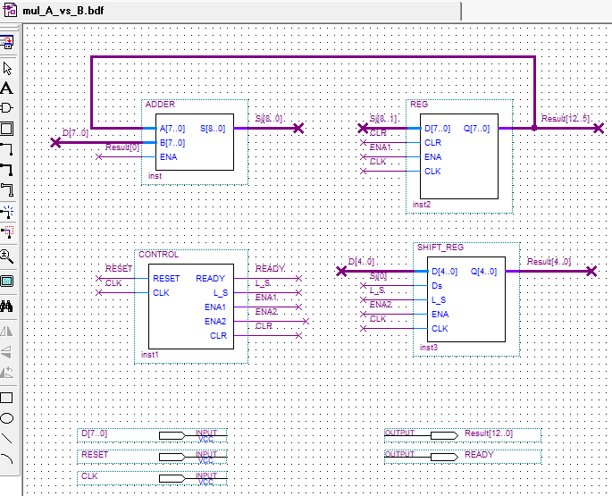

# multiple_two_numbers
Phép nhân 2 số A và B có n bit


Ý tưởng là lấy số A nhân với bit Bi rồi đưa vào thanh ghi, sau đó dịch chuyển thực hiện phép cộng



## Xây dựng module thực hiện phép nhân nối tiếp

Ở trên hiển thị một sơ đồ của một thiết bị nhân nối tiếp

Hình vẽ trên bao gồm:
1) bộ cộng tổ hợp “ADDER”, tùy thuộc vào tín hiệu S0 tương ứng với bit bi được phân tích, thực hiện phép cộng dữ liệu tại các cổng đầu vào, hoặc chuyển đến đầu ra dữ liệu từ cổng A [7..0];
2) thanh ghi “REG” và “SHIFT_REG”, lưu trữ trong đó tổng các phép nhân từng phần được tích lũy (trong “SHIFT_REG”, ngoài ra, thừa số B được lưu trữ trong quá trình thiết lập ban đầu);
3) thiết bị điều khiển "CONTROL", thực hiện việc đưa ra các tín hiệu điều khiển cần thiết tới các khối hoạt động được liệt kê. Khi tín hiệu Reset được áp dụng, thanh ghi REG được đặt thành 0 và thừa số B được tải vào thanh ghi SHIFT_REG từ bus dữ liệu D [4..0]. Sau khi hoàn thành thiết lập ban đầu, thừa số  A được đặt trên kênh dữ liệu D[7..0] và sự tích lũy của tổng các phép nhân từng phần bắt đầu thực hiện, kết thúc sau MỘT SỐ (cụ thể là 5) nhịp đồng hồ. Khi nhận được kết quả cuối cùng, tín hiệu READY được thiết lập.


## Cách cài đặt
Clone project từ git về
### Cài đặt git ở site `https://git-scm.com/downloads`
### Lấy source code project

*Bài 1 <Branch `master`>*: 
Sử dụng lệnh sau trong git bash tại thư mục chứa project
```cmd
git checkout -b master
```

*Bài 2 <Branch `10bit`>*: 
Sử dụng lệnh sau trong git bash tại thư mục chứa project
```cmd
git checkout -b 10bit
```
